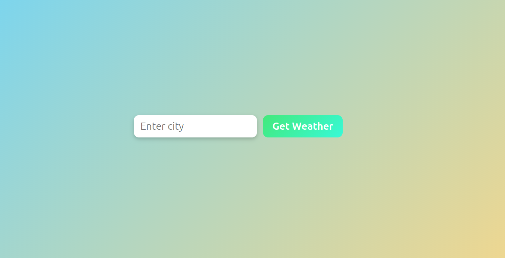
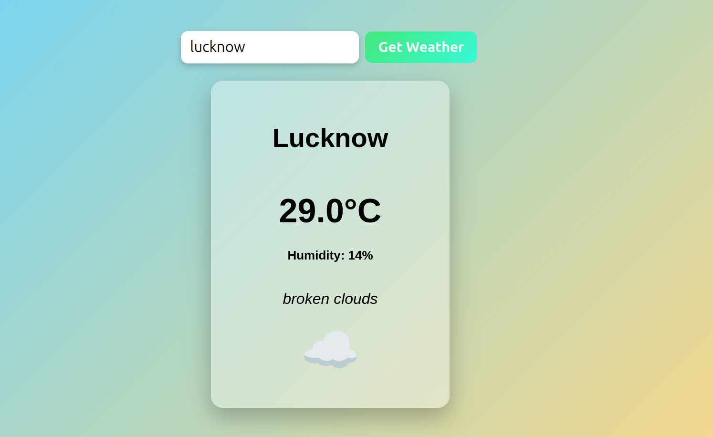

# 🌤 Weather App

A simple and responsive **Weather Application** that allows users to check the current weather of any city.
The app fetches real-time weather data using a weather API and displays temperature, humidity, description, and weather icons.

---

## 🚀 Features

* Search weather by **city name**
* Displays:

  * 🌡 Temperature
  * 💧 Humidity
  * 🌥 Weather description
  * 🌍 City name
  * 🌤 Weather emoji/icon
* Clean **glassmorphism UI**
* Smooth hover and focus animations
* Responsive layout

---

## 🛠 Tech Stack

* **HTML5** – structure of the application
* **CSS3** – styling and UI design
* **JavaScript (ES6)** – fetching API data and dynamic updates

---

## 📂 Project Structure

```
weather-app/
│
├── index.html      # Main HTML structure
├── styles.css      # Styling and UI design
├── index.js        # API calls and weather logic
├── images/
│   ├── img1.png
│   ├── img2.png
│   └── img3.png
└── README.md       # Project documentation
```

---

## ⚙️ How It Works

1. User enters a **city name** in the input field.
2. The form submission triggers JavaScript.
3. JavaScript sends a request to the **weather API**.
4. The API returns weather data in JSON format.
5. The app extracts and displays:

   * Temperature
   * Humidity
   * Weather condition
   * Emoji based on weather ID.

---

## ▶️ How to Run the Project

1. Clone the repository

```bash
git clone https://github.com/your-username/weather-app.git
```

2. Navigate to the project folder

```bash
cd weather-app
```

3. Open **index.html** in your browser.

---

## 📸 Preview

The app contains:

* A **city input field**
* A **Get Weather button**
* A dynamic **weather card** displaying the results.





---
